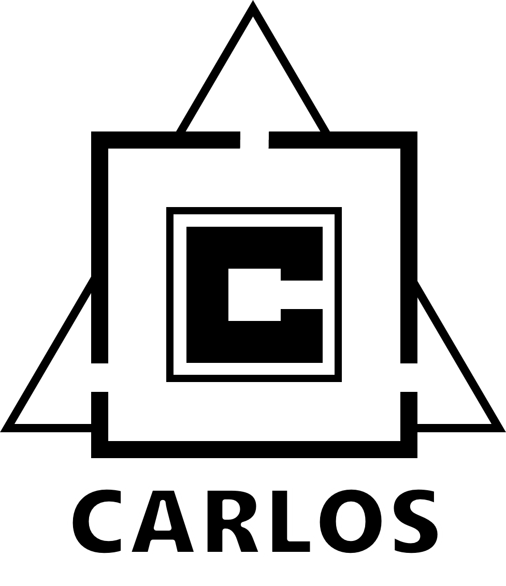

# CARLOS CI Action



This repository contains a GitHub Action that enables fully automated testing inside of a [CARLA](https://carla.org//) based simulation environment.
The action leverages [CARLOS](https://github.com/ika-rwth-aachen/carlos), an open, modular and scalable simulation architecture, which is presented in our [paper](http://arxiv.org/abs/2404.01836). Besides the action itself, this repository also contains detailed instructions on the usage and configuration.

## Notice

> [!IMPORTANT]  
> This repository is open-sourced and maintained by the [**Institute for Automotive Engineering (ika) at RWTH Aachen University**](https://www.ika.rwth-aachen.de/).  
> **Simulation, Containerization and DevOps for Automated Driving** are some of many research topics within our [*Vehicle Intelligence & Automated Driving*](https://www.ika.rwth-aachen.de/en/competences/fields-of-research/vehicle-intelligence-automated-driving.html) domain.  
> If you would like to learn more about how we can support your DevOps or automated driving efforts, feel free to reach out to us!  
> &nbsp;&nbsp;&nbsp;&nbsp; *Timo Woopen - Manager Research Area Vehicle Intelligence & Automated Driving*  
> &nbsp;&nbsp;&nbsp;&nbsp; *+49 241 80 23549*  
> &nbsp;&nbsp;&nbsp;&nbsp; *timo.woopen@ika.rwth-aachen.de*

## Content

- [**CARLOS CI Action**](#carlos-ci-action)
  - [Publication](#publication)
  - [About](#about)
    - [Prerequisites](#prerequisites)
    - [Basic Usage](#basic-usage)
  - [Configuration Variables](#configuration-variables)
  - [Citation](#citation)
  - [Acknowledgements](#acknowledgements)

## Publication

> **CARLOS: An Open, Modular, and Scalable Simulation Framework for the Development and Testing of Software for C-ITS**  
> > *([arXiv](http://arxiv.org/abs/2404.01836), [ResearchGate](https://www.researchgate.net/publication/379484629_CARLOS_An_Open_Modular_and_Scalable_Simulation_Framework_for_the_Development_and_Testing_of_Software_for_C-ITS))*  
>
> [Christian Geller](https://www.ika.rwth-aachen.de/de/institut/team/fahrzeugintelligenz-automatisiertes-fahren/geller.html), [Benedikt Haas](https://github.com/BenediktHaas96), [Amarin Kloeker](https://www.ika.rwth-aachen.de/en/institute/team/vehicle-intelligence-automated-driving/kloeker-amarin.html), [Jona Hermens](TODO), [Bastian Lampe](https://www.ika.rwth-aachen.de/en/institute/team/vehicle-intelligence-automated-driving/lampe.html), [Lutz Eckstein](https://www.ika.rwth-aachen.de/en/institute/team/univ-prof-dr-ing-lutz-eckstein.html)
> [Institute for Automotive Engineering (ika), RWTH Aachen University](https://www.ika.rwth-aachen.de/en/)
> 
> <sup>*Abstract* – Future mobility systems and their components are increasingly defined by their software. The complexity of these cooperative intelligent transport systems (C-ITS)  and the ever-changing requirements posed at the software require continual software updates. The dynamic nature of the system and the practically innumerable scenarios in which different software components work together necessitate efficient and automated development and testing procedures that use simulations as one core methodology. The availability of such simulation architectures is a common interest among many stakeholders, especially in the field of automated driving. That is why we propose CARLOS - an open, modular, and scalable simulation framework for the development and testing of software in C-ITS that leverages the rich CARLA and ROS ecosystems. We provide core building blocks for this framework and explain how it can be used and extended by the community. Its architecture builds upon modern microservice and DevOps principles such as containerization and continuous integration. In our paper, we motivate the architecture by describing important design principles and showcasing three major use cases - software prototyping, data-driven development, and automated testing. We make CARLOS and example implementations of the three use cases publicly available at [https://github.com/ika-rwth-aachen/carlos](https://github.com/ika-rwth-aachen/carlos).</sup>

---

## About

The *CARLOS CI Action* provides a fully automated way to integrate simulation testing into your [GitHub Actions workflows](https://docs.github.com/en/actions/using-workflows).

The action performs the following steps:

1. *(optional)* Download Composefile as a template from a separate GitHub repository
2. Render simulation environment Composefile by merging local (and optionally remote) templates
3. Deploy simulation environment via Docker Compose
4. Render Scenario Runner Composefile
5. Deploy Scenario Runner via Docker Compose and execute scenario
6. Tear down simulation environment

### Prerequisites

> [!IMPORTANT]
> Since this action utilizes resource-heavy tools like the [CARLA simulator](https://carla.org//) and requires the environment to persist between the action steps, it cannot be used with [GitHub-hosted runners](https://docs.github.com/en/actions/using-github-hosted-runners/about-github-hosted-runners).

To use this action, a [*self-hosted runner*](https://docs.github.com/en/actions/hosting-your-own-runners/managing-self-hosted-runners/about-self-hosted-runners) is a necessity. For details on how to install and configure such a runner, please refer to the [official documentation](https://docs.github.com/en/actions/hosting-your-own-runners).
Additionally, the machines hosting the runners need to fulfill the following requirements:

1. Meets [CARLA system requirements](https://carla.readthedocs.io/en/latest/start_quickstart/#before-you-begin) (e.g. 6-8 GB GPU)
2. Working installation of [Docker](https://www.docker.com/) and [Docker Compose](https://docs.docker.com/compose/) (installation of [Docker Desktop](https://docs.docker.com/desktop/) includes both)
3. Docker has access to GPU on host via vendor-specific tools ([Nvidia Container Toolkit](https://docs.nvidia.com/datacenter/cloud-native/container-toolkit/latest/install-guide.html) or [ROCm](https://github.com/ROCm/ROCm-docker/blob/master/quick-start.md))
4. User that started the runner (either directly or as a [service](https://docs.github.com/en/actions/hosting-your-own-runners/managing-self-hosted-runners/configuring-the-self-hosted-runner-application-as-a-service)) needs to be in the *docker* group (see [official documentation](https://docs.docker.com/engine/install/linux-postinstall/#manage-docker-as-a-non-root-user) for details)

### Basic Usage

## Configuration Variables

- **`composefile-path`** (*default:* `${{ github.action_path }}/templates/carla-simulator.yml`)

  Path to Composefile that will be used directly or via merge with a remote file for the deployment
- **`remote-repository`**

  Optional GitHub repository containing Composefiles ( org1/repo1 => github.com/org1/repo1 )
- **`remote-composefile`**

  Path to the Composefile from the remote repository which should be downloaded
- **`remote-path`** (*default:* `./rendercompose-remote/`)
  
  Path relative to working directory where the remote files will be placed
- **`remote-deploykey`**

  [Deploy key](https://docs.github.com/en/authentication/connecting-to-github-with-ssh/managing-deploy-keys) that will be used to access the remote repository
- **`rendered-composefile`** (*default:* `./simulation-environment.yml`)

  Path where the rendered Composefile should be placed
- **`sim-startup-delaysecs`** (*default:* `10`)

  Seconds to wait after starting environment and before scenario execution
- **`scenario-runner-image`** (*default:* `rwthika/carla-scenario-runner:latest`)

  Docker image of the CARLA scenario runner
- **`scenario-folder-path`** (*required*)

  Path to folder containing the scenario(s) and optional catalogs subfolder
- **`scenario-file-name`** (*required*)

  Filename of scenario
- **`carla-hostname`** (*default:* `carla-simulator`)

  Hostname of CARLA simulator that the scenario runner should connect to
- **`docker-network`** (*default:* `carlos-ci-action_default`)

  Docker network that the scenario runner should attach to

## Citation

We hope that our simulation framework CARLOS and this action can help your research. If this is the case, please cite it using the following metadata.
```
@inproceedings{CARLOS24,
author = {Geller, Christian and Haas, Benedikt and Kloeker, Amarin and Hermens, Jona and Lampe, Bastian and Eckstein, Lutz},
title = {{CARLOS: An Open, Modular, and Scalable Simulation Framework for the Development and Testing of Software for C-ITS}},
url = {http://arxiv.org/abs/2404.01836},
year = {2024}
}
```

## Acknowledgements

This research is accomplished within the project [AUTOtech.*agil*](https://www.ika.rwth-aachen.de/en/competences/projects/automated-driving/autotech-agil-en.html) (FKZ 01IS22088A). We acknowledge the financial support for the project by the Federal Ministry of Education and Research of Germany (BMBF).
